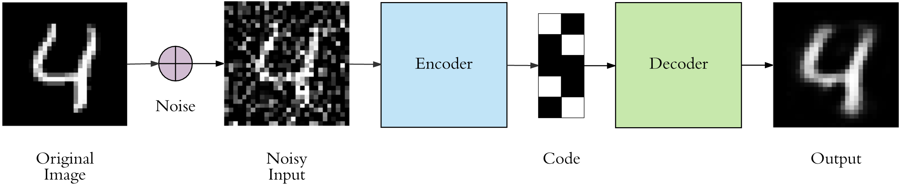
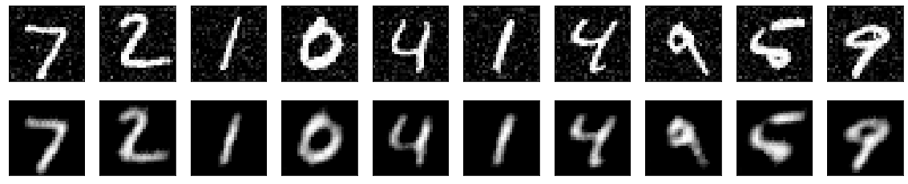
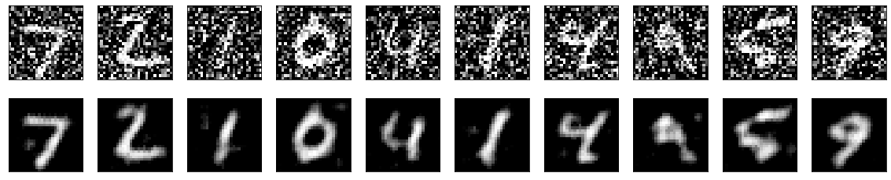
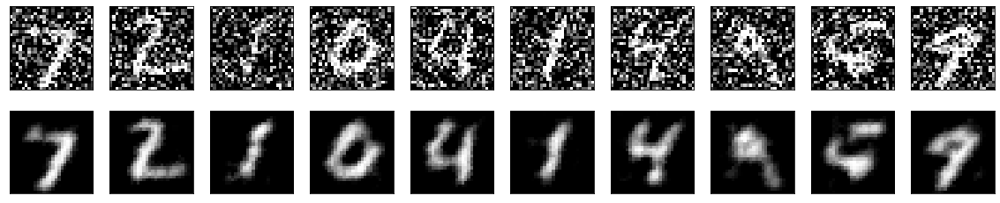
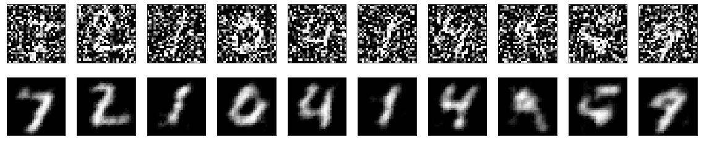

# Image Noise Reduction using Auto Encoder
## Discription
In this project, a convolutional autoencoder is presented which is trained to denosify images. Model is trained on the actual images and nosiy images and tested with noisy images. 

# Background Detailes
## What is Auto Encoder?
An autoencoder is a type of artificial neural network used to learn efficient data codings in an unsupervised manner. The aim of an autoencoder is to learn a representation for a set of data, typically for dimensionality reduction, by training the network to ignore signal “noise”

## Data used to train the model
MNIST data is used to train and test the model

## Architecture 

[Link](https://www.google.com/url?sa=i&url=https%3A%2F%2Ftowardsdatascience.com%2Fapplied-deep-learning-part-3-autoencoders-1c083af4d798&psig=AOvVaw397Kx6myIm1tXB1I3zyYmA&ust=1591435653920000&source=images&cd=vfe&ved=0CAIQjRxqFwoTCMjB-_-t6ukCFQAAAAAdAAAAABAR)
# Results
## 50% noise in training data and 10% noise in testing data

## 50% noise in training data and 50% noise in testing data

## 70% noise in training data and 50% noise in testing data

## 70% noise in training data and 70% noise in testing data

